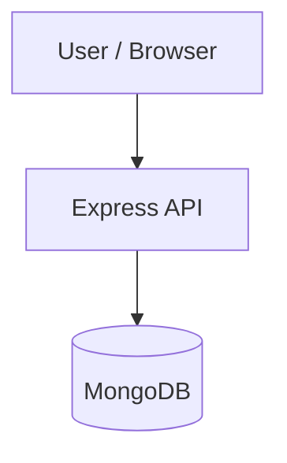

# Shuriken

> A full-stack social media platform API and frontend built with Express and React.

     

## 📑 Table of Contents

- [Description](#description)
- [Key Features](#key-features)
- [Use Cases](#use-cases)
- [Tech Stack](#tech-stack)
- [Architecture](#architecture)
- [Quick Start](#quick-start)
- [Key Dependencies](#key-dependencies)
- [Available Scripts](#available-scripts)
- [Project Structure](#project-structure)
- [Development Setup](#development-setup)
- [Deployment](#deployment)
- [Contributors](#contributors)
- [Contributing](#contributing)
- [License](#license)

## Description

Shuriken is a full-stack web application for content creation and social interaction. It addresses the core requirements of a modern community platform by providing structured endpoints for user profiles, posts, comments, likes, followers, and user dashboard analytics. The backend exposes a REST API while the client provides a responsive user interface.

The backend architecture is powered by Express.js and MongoDB using Mongoose for data modeling. Middleware handles CORS, JSON payloads, cookie parsing, and static file serving, while modular route modules direct traffic to dedicated handlers under the `/api/v1` base route. On the client side, React and React Router manage rendering and application flow, utilizing modular React Context providers to manage state across distinct domains like posts, user channels, and comments.

## Key Features

- **User and Profile Management** — Provides backend route handling and React Context providers for user authentication, profiles, and channels.
- **Post Creation and Editing** — Supports creating, editing, and displaying post feeds supported by dedicated backend post routes and context state.
- **Comments and Likes Engine** — Implements API routes and context state to allow users to comment on posts and like content.
- **Follower Relationship System** — Tracks social connections and follow lists through dedicated API endpoints and frontend providers.
- **Dashboard Analytics** — Aggregates user metrics and dashboard statistics for display on the client UI.
- **Express and MongoDB Stack** — Utilizes Express.js middleware and Mongoose database connections to deliver a structured RESTful API.

## Use Cases

- Launching a modern social network or media-sharing web application.
- Studying a modular full-stack architecture built with Express.js REST APIs and React Context.
- Developing a base starter platform with pre-configured social interactions and state management.

## Tech Stack

   

**Notable libraries:** Mongoose, Multer

## Architecture

A high-level view of how the main pieces fit together:



## Quick Start

```bash

# 1. Clone the repository
git clone https://github.com/holyarsenic/Shuriken.git

# 2. Install dependencies
npm install

# 3. Start the dev server
npm run dev
```

## Key Dependencies

```
bcrypt: ^6.0.0
cloudinary: ^2.10.0
cookie-parser: ^1.4.7
cors: ^2.8.6
dotenv: ^17.4.2
express: ^5.2.1
jsonwebtoken: ^9.0.3
mongoose: ^9.7.1
mongoose-aggregate-paginate-v2: ^1.1.4
multer: ^2.2.0
```

## Available Scripts

- **dev** — `npm run dev`
- **start** — `npm run start`

## Project Structure

```
.
├── Backend
│   ├── package.json
│   └── src
│       ├── app.js
│       ├── constants.js
│       ├── controllers
│       │   ├── comment.controller.js
│       │   ├── dashboard.controller.js
│       │   ├── followList.controller.js
│       │   ├── like.controller.js
│       │   ├── post.controller.js
│       │   └── user.controller.js
│       ├── db
│       │   └── index.js
│       ├── index.js
│       ├── middlewares
│       │   ├── auth.middleware.js
│       │   └── multer.middleware.js
│       ├── models
│       │   ├── comment.models.js
│       │   ├── followList.models.js
│       │   ├── like.models.js
│       │   ├── post.models.js
│       │   ├── postView.models.js
│       │   └── user.models.js
│       ├── routes
│       │   ├── comment.routes.js
│       │   ├── dashboard.routes.js
│       │   ├── followList.routes.js
│       │   ├── like.routes.js
│       │   ├── post.routes.js
│       │   └── user.routes.js
│       └── utils
│           ├── ApiError.js
│           ├── ApiResponse.js
│           ├── asynchandler.js
│           └── cloudnary.js
└── Frontend
    ├── eslint.config.js
    ├── index.html
    ├── package.json
    ├── public
    │   ├── favicon.svg
    │   └── icons.svg
    ├── src
    │   ├── App.jsx
    │   ├── api
    │   │   └── axios.js
    │   ├── assets
    │   │   └── Logo.jpeg
    │   ├── components
    │   │   ├── Comments.component.jsx
    │   │   ├── DashboardCharts
    │   │   │   ├── LineChart.jsx
    │   │   │   └── PieChart.jsx
    │   │   ├── EditPostPage.jsx
    │   │   ├── EditProfilePage.jsx
    │   │   ├── Followers.jsx
    │   │   ├── Following.jsx
    │   │   ├── LikedPosts.component.jsx
    │   │   ├── Navbar.jsx
    │   │   ├── ResponsiveComponents
    │   │   │   └── RespCommentBox.jsx
    │   │   └── SearchBar.component.jsx
    │   ├── context
    │   │   ├── channelProfile.jsx
    │   │   ├── commentPage.jsx
    │   │   ├── dashboardStats.jsx
    │   │   ├── editPost.jsx
    │   │   ├── followList.jsx
    │   │   ├── homePost.jsx
    │   │   ├── likedPosts.jsx
    │   │   ├── specificPost.jsx
    │   │   ├── theme.jsx
    │   │   ├── user.jsx
    │   │   └── userProfile.jsx
    │   ├── index.css
    │   ├── layout
    │   │   ├── NavbarLayout.jsx
    │   │   └── ProtectedRoute.jsx
    │   ├── main.jsx
    │   └── pages
    │       ├── Channel.jsx
    │       ├── Create.jsx
    │       ├── Dashboard.jsx
    │       ├── History.jsx
    │       ├── Home.jsx
    │       ├── Login.jsx
    │       ├── PostDetails.jsx
    │       ├── Profile.jsx
    │       ├── Register.jsx
    │       └── Settings.jsx
    ├── vercel.json
    └── vite.config.js
```

## Development Setup

### Node.js / JavaScript
1. Install Node.js (v18+ recommended)
2. Install dependencies: `npm install` (or `yarn` / `pnpm install` / `bun install`)
3. Start the dev server: see the **Quick Start** above

## Deployment

### Vercel

This project is configured for [Vercel](https://vercel.com). Push to the connected branch or run `vercel` locally.

## Contributors

Thanks to everyone who has contributed to this project:

<p align="left">
<a href="https://github.com/holyarsenic" title="holyarsenic"></a>
</p>

[See the full list of contributors →](https://github.com/holyarsenic/Shuriken/graphs/contributors)

## Contributing

Contributions are welcome! Here's the standard flow:

1. **Fork** the repository
2. **Clone** your fork: `git clone https://github.com/holyarsenic/Shuriken.git`
3. **Branch**: `git checkout -b feature/your-feature`
4. **Commit**: `git commit -m 'feat: add some feature'`
5. **Push**: `git push origin feature/your-feature`
6. **Open** a pull request

Please follow the existing code style and include tests for new behavior where applicable.

## 📜 License

This project is licensed under the **ISC** License.

---

