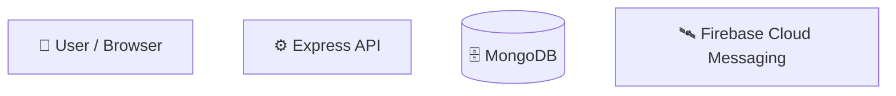

# Shuriken

> Full-stack social media platform for image discovery and community interaction.

      

## Table of Contents

- [Description](#description)
- [Key Features](#key-features)
- [Use Cases](#use-cases)
- [Tech Stack](#tech-stack)
- [Architecture](#architecture)
- [Quick Start](#quick-start)
- [Key Dependencies](#key-dependencies)
- [Available Scripts](#available-scripts)
- [Project Structure](#project-structure)
- [Development Setup](#development-setup)
- [Deployment](#deployment)
- [Contributors](#contributors)
- [Contributing](#contributing)
- [License](#license)

## Description

Shuriken is a full-stack social media application engineered for content creation and community engagement. It powers structured web services to manage user profiles, image posts, comments, likes, follower relationships, real-time push notifications, and user dashboard analytics — delivered through both a RESTful API backend and a reactive client-side interface.

## Key Features

- **Modular Express REST API** — Exposes structured backend endpoints under `/api/v1` for users, follow lists, posts, comments, likes, notifications, and dashboard data.
- **MongoDB Data Persistence** — Uses Mongoose to connect to MongoDB for schema modeling and structured data storage.
- **React Context State Architecture** — Manages client-side domain state using React Context providers for profiles, posts, comments, likes, and analytics.
- **Middleware Request Processing** — Configures Express middleware for cookie parsing, CORS support, static file serving, and JSON body parsing.
- **Multipart File Upload Support** — Utilizes Multer middleware on the backend to handle image and file uploads for media content.
- **Real-Time Push Notifications** — Firebase Cloud Messaging (FCM) integration delivers live notifications to users, backed by a dedicated service worker

## Use Cases

- Deploying a self-hosted social networking platform with user profile and post discovery features.
- Serving as a full-stack reference architecture for Express and React application development.
- Building community platforms with modular state management and dashboard metrics.

## Tech Stack

   

**Notable libraries:** Mongoose, Multer

## Architecture

A high-level view of how the main pieces fit together:


```mermaid
flowchart TD
    User["👤 User / Browser"]
    API["⚙️ Express API"]
    DB[("🗄️ MongoDB")]
    FCM["🛰️ Firebase Cloud Messaging"] 
```

## Quick Start

```bash

# 1. Clone the repository
git clone https://github.com/holyarsenic/Shuriken.git

# 2. Install dependencies
npm install

# 3. Start the dev server
npm run dev
```

## Key Dependencies

```
bcrypt: ^6.0.0
cloudinary: ^2.10.0
cookie-parser: ^1.4.7
cors: ^2.8.6
dotenv: ^17.4.2
express: ^5.2.1
firebase-admin: ^14.2.0
jsonwebtoken: ^9.0.3
mongoose: ^9.7.1
mongoose-aggregate-paginate-v2: ^1.1.4
multer: ^2.2.0
```

## Available Scripts

- **dev** — `npm run dev`
- **start** — `npm run start`

## Project Structure

```
.
├── Backend
│   ├── package.json
│   └── src
│       ├── app.js
│       ├── constants.js
│       ├── controllers
│       │   ├── comment.controller.js
│       │   ├── dashboard.controller.js
│       │   ├── followList.controller.js
│       │   ├── like.controller.js
│       │   ├── notification.controller.js
│       │   ├── post.controller.js
│       │   └── user.controller.js
│       ├── db
│       │   └── index.js
│       ├── index.js
│       ├── middlewares
│       │   ├── auth.middleware.js
│       │   └── multer.middleware.js
│       ├── models
│       │   ├── comment.models.js
│       │   ├── followList.models.js
│       │   ├── like.models.js
│       │   ├── notification.models.js
│       │   ├── post.models.js
│       │   ├── postView.models.js
│       │   └── user.models.js
│       ├── routes
│       │   ├── comment.routes.js
│       │   ├── dashboard.routes.js
│       │   ├── followList.routes.js
│       │   ├── like.routes.js
│       │   ├── notification.routes.js
│       │   ├── post.routes.js
│       │   └── user.routes.js
│       └── utils
│           ├── ApiError.js
│           ├── ApiResponse.js
│           ├── asynchandler.js
│           ├── cloudnary.js
│           ├── firebase.config.js
│           └── sendNotification.js
└── Frontend
    ├── eslint.config.js
    ├── firebase.js
    ├── index.html
    ├── package.json
    ├── public
    │   ├── favicon.svg
    │   ├── firebase-messaging-sw.js
    │   ├── icons.svg
    │   ├── shuriken-192x192.png
    │   └── shuriken-512x512.png
    ├── src
    │   ├── App.jsx
    │   ├── api
    │   │   └── axios.js
    │   ├── assets
    │   │   └── Logo.jpeg
    │   ├── components
    │   │   ├── Comments.component.jsx
    │   │   ├── DashboardCharts
    │   │   │   ├── LineChart.jsx
    │   │   │   └── PieChart.jsx
    │   │   ├── EditPostPage.jsx
    │   │   ├── EditProfilePage.jsx
    │   │   ├── Followers.jsx
    │   │   ├── Following.jsx
    │   │   ├── LikedPosts.component.jsx
    │   │   ├── Navbar.jsx
    │   │   ├── NotificationPage.jsx
    │   │   ├── ResponsiveComponents
    │   │   │   └── RespCommentBox.jsx
    │   │   └── SearchBar.component.jsx
    │   ├── context
    │   │   ├── channelProfile.jsx
    │   │   ├── commentPage.jsx
    │   │   ├── dashboardStats.jsx
    │   │   ├── editPost.jsx
    │   │   ├── followList.jsx
    │   │   ├── homePost.jsx
    │   │   ├── likedPosts.jsx
    │   │   ├── notification.jsx
    │   │   ├── specificPost.jsx
    │   │   ├── theme.jsx
    │   │   ├── user.jsx
    │   │   └── userProfile.jsx
    │   ├── index.css
    │   ├── layout
    │   │   ├── NavbarLayout.jsx
    │   │   └── ProtectedRoute.jsx
    │   ├── main.jsx
    │   ├── pages
    │   │   ├── Channel.jsx
    │   │   ├── Create.jsx
    │   │   ├── Dashboard.jsx
    │   │   ├── History.jsx
    │   │   ├── Home.jsx
    │   │   ├── Login.jsx
    │   │   ├── PostDetails.jsx
    │   │   ├── Profile.jsx
    │   │   ├── Register.jsx
    │   │   └── Settings.jsx
    │   └── utils
    │       └── NotificationService.js
    ├── vercel.json
    └── vite.config.js
```

## Development Setup

### Node.js / JavaScript
1. Install Node.js (v18+ recommended)
2. Install dependencies: `npm install` (or `yarn` / `pnpm install` / `bun install`)
3. Start the dev server: see the **Quick Start** above

## Deployment

Frontend Vercel — Vite-built React app
Render (Backend)

## Contributors

<p align="left">
<a href="https://github.com/holyarsenic" title="holyarsenic"></a>
</p>

[See the full list of contributors →](https://github.com/holyarsenic/Shuriken/graphs/contributors)

## 👥 Contributing

Contributions are welcome! Here's the standard flow:

1. **Fork** the repository
2. **Clone** your fork: `git clone https://github.com/holyarsenic/Shuriken.git`
3. **Branch**: `git checkout -b feature/your-feature`
4. **Commit**: `git commit -m 'feat: add some feature'`
5. **Push**: `git push origin feature/your-feature`
6. **Open** a pull request

Please follow the existing code style and include tests for new behavior where applicable.

## License

This project is licensed under the **ISC** License.

---
